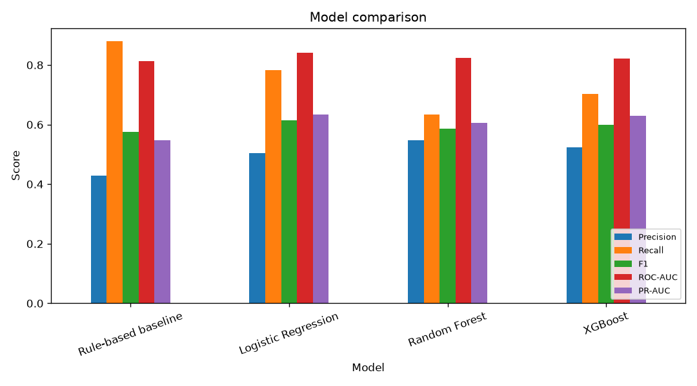
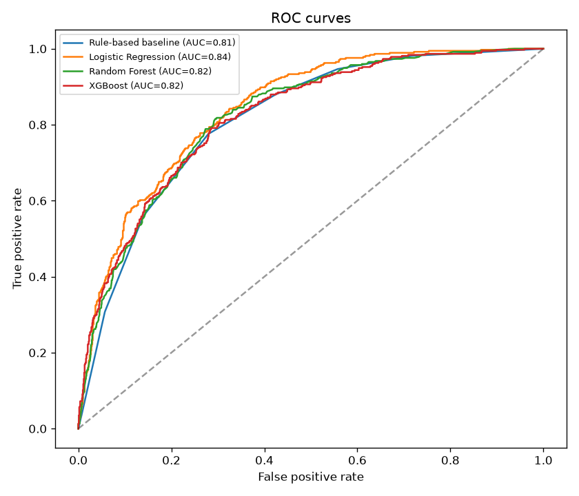
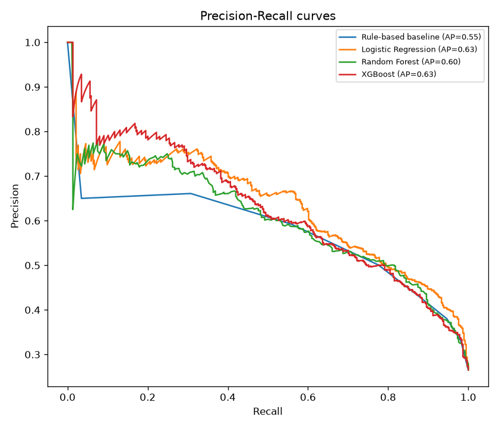
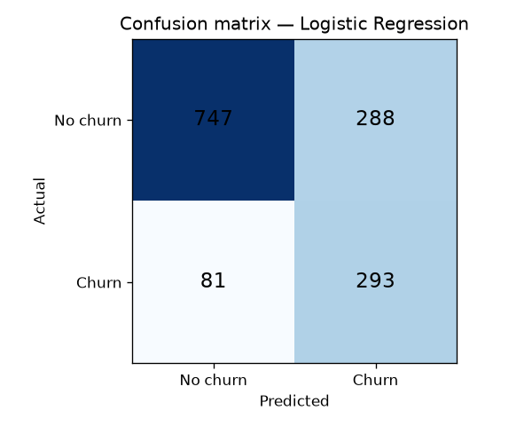
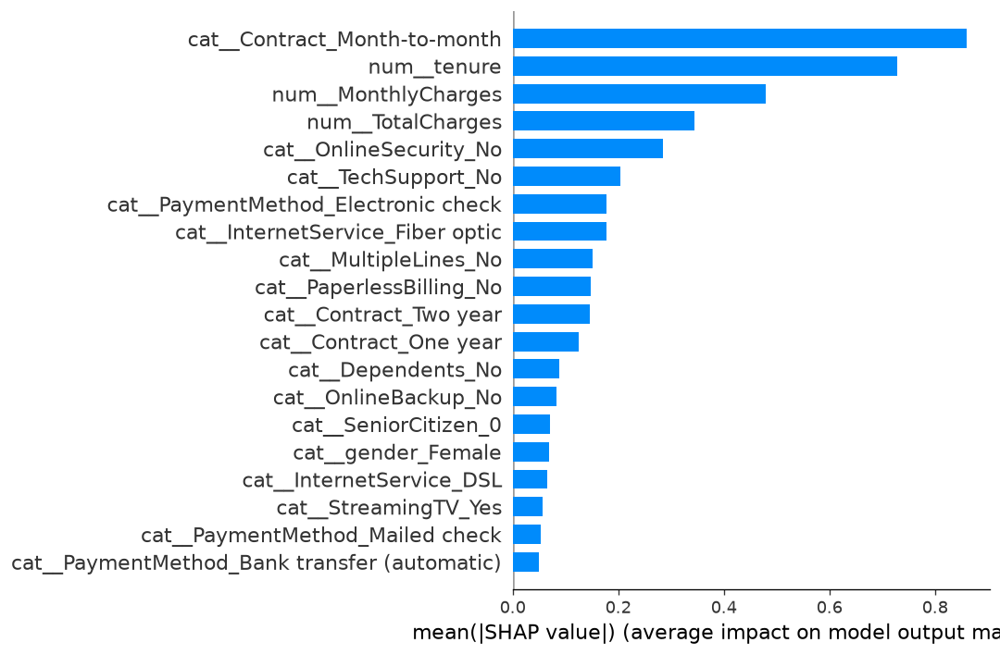
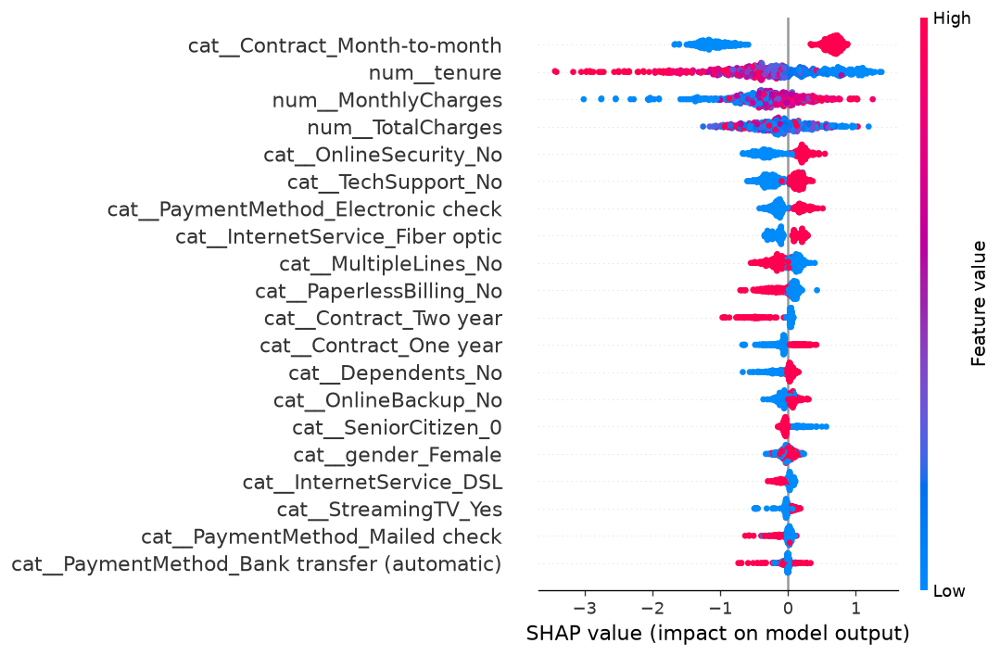

# Retention Marketing Using Explainable Machine Learning for Churn Prediction

**Name of the Student — Priyanshu Kumar Mishra**

**Live URL:** https://project.priyanshumishra.in

---

## How it works

An MCA major project: a customer-churn prediction system that predicts which
customers are likely to leave, explains **why** for every prediction, and
recommends a retention action — served as a small web app.

The project has three parts:

1. **Offline ML core** (`src/`) — cleans the Telco Customer Churn dataset, trains a
   rule-based baseline plus three machine-learning models, evaluates them, and saves
   the best model along with the report charts.

2. **Backend API** (`backend/`) — a FastAPI service that loads the saved model and does
   **inference only**: score a customer, explain why (via SHAP), recommend a retention
   action, and score a whole uploaded CSV.

3. **Frontend** (`frontend/`) — a React + Tailwind app with three screens: a
   **Dashboard** of model metrics and charts, a **Predict-a-customer** screen, and a
   **Batch upload** screen.

### The prediction → explanation flow

1. A customer's details are sent to the backend.
2. The **ML model** produces a churn probability and a risk level (Low / Medium / High).
3. **SHAP** explains how much each feature pushed that customer toward churn, giving the
   top risk factors in plain language.
4. The top factor is mapped to a concrete **retention action** from a small playbook.
5. The frontend shows the probability, the risk badge, the top factors, and the
   recommended action.

The churn probability **always** comes from the ML model — the explanation layer only
turns that output into words; it never computes or changes the number.

---

## Results

All charts below are generated by the offline ML core and saved to `outputs/`.

### Model comparison
How the rule-based baseline and the three ML models score against each other.

### Ranking quality — ROC and Precision–Recall curves

### Confusion matrix (best model)

### Why the model flags churn — SHAP explanations

